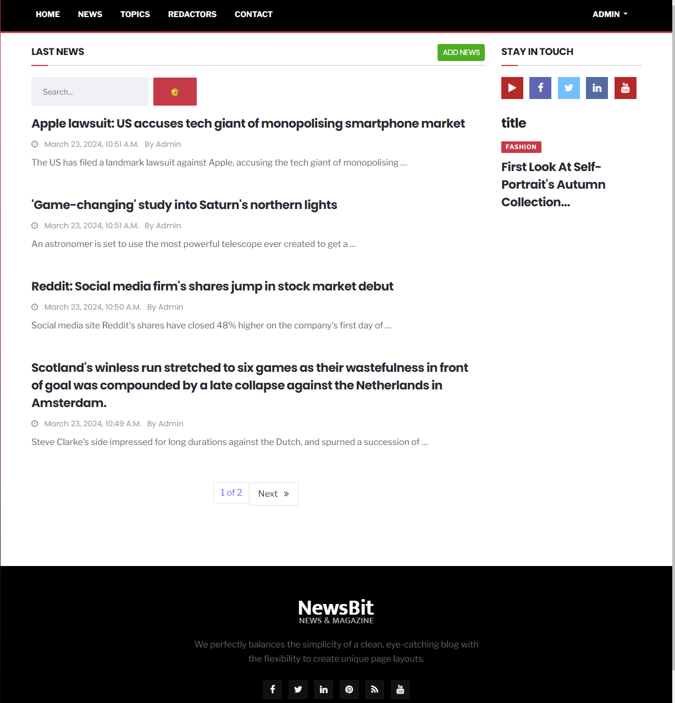

# Newspaper Agency

Django project for managing news and redactors in Newspaper

## Check it out:

[Newspaper Agency Developed for Render](https://localhost/)

## Installation

Python3 must be already installed

```shell
git clone https://github.com/Shantagust/Newspaper-Agency.git
cd newspaper-agency
python3 -m venv venv
source venv/bin/activate
pip install -r requirements.txt
python3 manage.py runserver localhost #start django project
```

## Features 

* Authenticate functional for Redactors
* Managing news and news topics
* Powerful admin panel for advancing managing


# Demo
